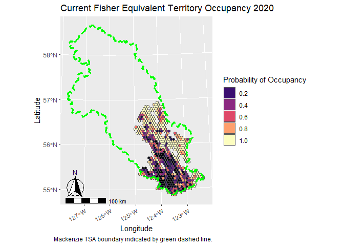
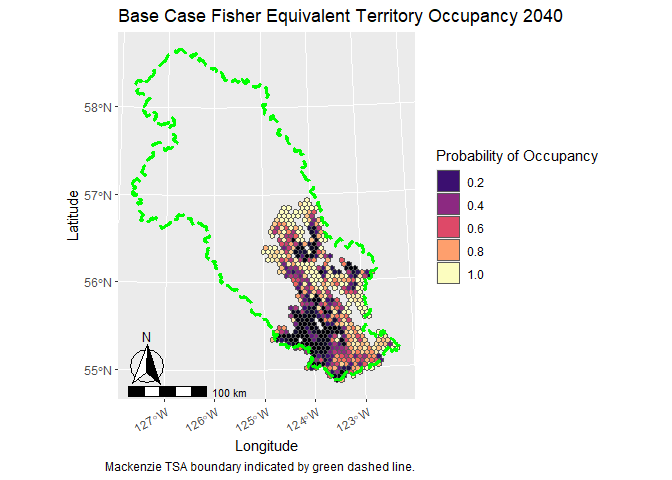
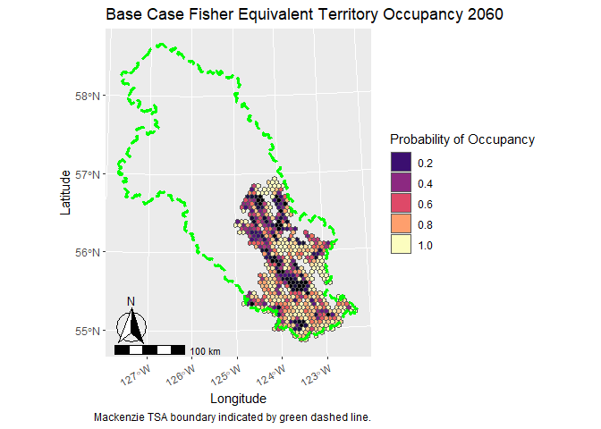
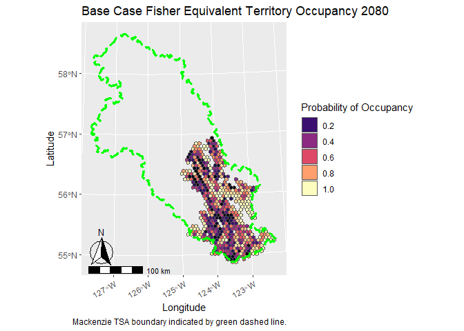
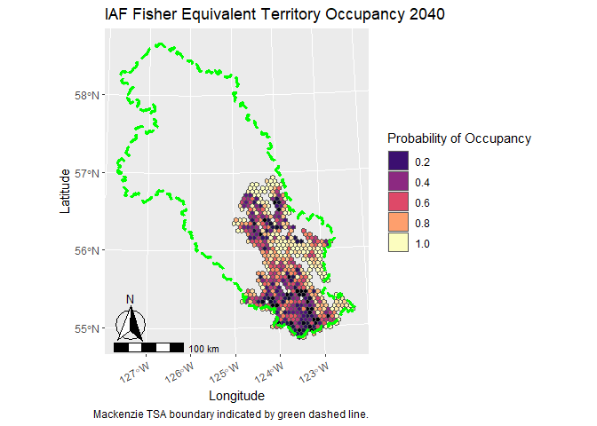
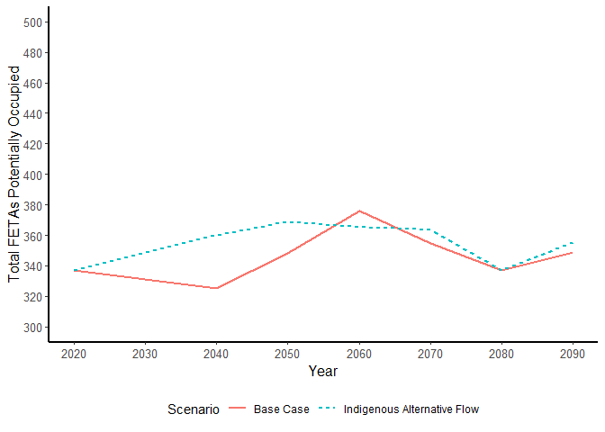

## Mackenzie Timber Supply Review Fisher Indicator Analysis
Here I calculate indicators of fisher (*Pekania pennanti*) territory occupancy to support the Mackenzie timber supply review. Fisher are a species of concern to First Nations in the region, and to the governments of British Columbia and Canada. First Nations requested an analysis to assess the potential influence of future simulated forest harvest on fisher as part of the timber supply review.

Fisher territory occupancy was estimated using the model developed by Weir and Courbold 2010, where the percentage of a fisher territory that is wetlands or less than 12 year old logged forest (i.e, "open area") was found to be the best indicator of whether a territory was occupied by fisher. Territories with more wetland or logged forest were less likely to be occupied. The data used to develop this model was collected northwest of the town of Mackenzie, in the late 1990's and early 2000's. 

An important limitation on the use of this model for this timber supply review is that it only provides a relative measure of territory occupancy and does not consider the quality of habitat within territories. For example, this approach does not evaluate the presence of large trees with cavities that are necessary for fisher denning. Therefore, even though the probability of occupancy for a given territory may be high, it does not mean that all of the habitat features necessary for fisher survival and reproduction are provided. This is important for interpretation of results, because, for example, an entire fisher territory could be completely logged and have a zero probability of occupancy for 12 years, but then could score a 100% probability of occupancy at year 13. However, realistically for the territory to be occupied it would require some stands at least 100 years old to provide denning cavities. Nevertheless, the model broadly serves as a useful indicator to evaluate fisher occupancy across a landscape based upon forest harvest history. 

We assess two forest harvest simulations, the 'base case' (BC) and 'indigenous alternative flow' (IAF), where each simulation represents different inputs to a spatial timber supply model. The BC approximates current forestry practices in the Mackenzie TSA carried forward into the future. In particular, existing legal requirements on forest harvest are used to define where forestry activities can, or cannot occur in the future. The IAF represents forest harvest practices where additional constraints have been created with the intent of maintaining indigenous values in the Mackenzie TSA. 

## Methods
Fisher territories range in size and shape, but here we create a standard territory size across fisher range within the TSA. Each territory is hexagon in shape and 30km^2 in size (i.e., an average fisher home range size; *R. Weir, pers. comm.*). Although not a biologically relevant shape, these can be considered as fisher-equivalent territory areas (FETAs), which represent the amount of area and habitat that could theoretically support a female fisher. 

The current and simulated future area of wetlands and logged forest less than 12 years old was calculated within each FETA. Data on current logged forest within the [Mackenzie timber supply area](https://catalogue.data.gov.bc.ca/dataset/fadm-timber-supply-area-tsa) was obtained from the [harvested areas](https://catalogue.data.gov.bc.ca/dataset/harvested-areas-of-bc-consolidated-cutblocks-) dataset. Data on wetlands was obtained from the [forest inventory data](https://catalogue.data.gov.bc.ca/dataset/vri-2020-forest-vegetation-composite-layer-1-l1-), where the B.C. land cover classification scheme was used to identify current non-treed wetland areas, which are assumed to be stable throughout the simulation period. Data on future cutblocks was obtained from the the spatial timber supply model at decadal intervals. To calculate the amount of logged area less than 12 years old, the amount of logged area in the previous decade was added to 20% of the area logged two decades prior. This assumes the amount of area logged over a decade is similar each year.   

FETA occupancy was calculated using the model developed by Weir and Courbold 2010, where the relative probability of occupancy is a function of the percentage of open area within a FETA. The percentage of open area was calculated as the amount of area logged in the previous 12 years added to the area of non-treed wetland and divided by the area of a FETA.

The total number of potentially occupied territories was estimated for each decade by taking the sum of probability of occupancy values of all FETAs in the Mackenzie TSA.

## Results
Currently, the relative probability of fisher occupancy of FETAs was relatively low in the southwest portion of the Mackenzie TSA, and relatively high in the east-central portion of the TSA. 

<!-- -->

### Base Case
In the base case simulation, the relative probability of occupancy increased in FETAs in the south-east portion of the TSA in 2040. However, relative probability of occupancy decreased in some FETAs in the east-central portion of the TSA.

<!-- -->

In 2060, the relative probability of occupancy increased in FETAs in the southern portion of the TSA, but the relative probability of occupancy decreased in the central portions of the TSA. 

<!-- -->

Relative probability of occupancy remained relatively low in central and northern portions of the TSA in 2080, and again declined to lower values in the southern portions of the TSA. Throughout the duration of the simulation, relative probability of occupancy of FETAs remained relatively high in east-central portions of the TSA. 

<!-- -->

### IAF
In the IAF, the relative probability of occupancy decreased in FETAs in the central portion of the TSA and increased slightly in FETAs in south-central portions of the TSA in 2040. 

<!-- -->

In 2060, the relative probability of occupancy increased in FETAs in the central portion of the TSA. 

<!-- -->

Relative probability of occupancy remained decreased in central portions of the TSA in 2080. Throughout the duration of the simulation, relative probability of occupancy of FETAs remained high in east-central portions of the TSA. 

<!-- -->

### Trends in Potential Occupied Territories
In both the BC and IAF, the number of potentially occupied FETAs was relatively stable across the simulation period. From 2020to 2050, the number of potentially occupied FETAs was 5% to 10% greater in the IAF compared to the BC. However, these values were similar in both scenarios from 2060 to 2090.

<!-- -->

## Discussion
In general, future potential FETA occupancy decreased in central portions of the TSA and increased in southern portions of the TSA in both scenarios. This reflects a shift in forest harvest from southern to central portions of the TSA in the near and mid-term. Overall, the IAF resulted in more potential occupied FETAs than the base case in the near to mid-term, but not the long-term.

An important limitation of the occupancy model approach used here is that it does not consider habitat quality within a FETA. A high probability of occupancy does not necessarily mean there is sufficient habitat within a FETA to support fishers biological needs. These results should therefore be used with caution.
